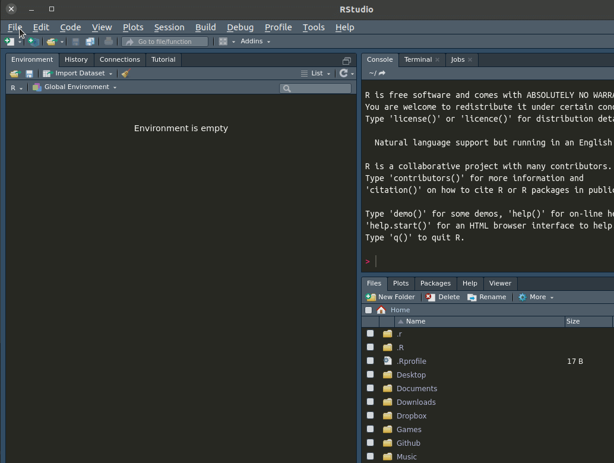

<!-- README.md is generated from README.Rmd. Please edit that file -->

```{r, include = FALSE}
knitr::opts_chunk$set(
  collapse = TRUE,
  comment = "#>",
  fig.path = "man/figures/README-",
  out.width = "100%"
)
```

# imecc.tese

O pacote `imecc.tese` fornece templates para formatação de teses do IMECC - UNICAMP
em formato `Rmarkdown`. O modelo é baseado na versão em LaTeX fornecida no próprio
site e também disponível em https://www.overleaf.com/latex/templates/modelo-tese-imecc-unicamp/hrryjftrmzhz.

Toda a sintaxe de LaTeX pode ser usada normalmente e, adicionalmente, a possibilidade
de se utilizar resultados de chunks executados na linguagem R, permite que a tese
possa conter o código e os resultados organizados nos mesmos arquivos, bem como
garantir a reproducibilidade dos resultados.

## Instalação

Instale o pacote diretamente do `R`, através do pacote `devtools` utilizando
a linha abaixo. Instale o `devtools` caso seja necessário.

```{r, eval = FALSE}
# install.packages("devtools")
devtools::install_github("Freguglia/imecc.tese")
```

## Criando o arquivo a partir do template

Uma vez instalado o pacote, se você utiliza o Rstudio, você pode criar um novo
arquivo acessando File -> New File -> R markdown..., selecione a aba
"From Template" e escolha `tese_imecc_pt` ou `tese_imecc_en` para os modelos
em Português ou Inglês, respectivamente. Uma pasta com o título escolhido será
criada no diretório atual com os arquivos necessários.



Caso não tenha o Rstudio, use a seguinte linha no R, trocando `<NOME>` pelo 
nome que você queira dar à pasta onde ficarão os arquivos, por exemplo, `tese`.

```{r, eval = FALSE}
rmarkdown::draft("<NOME>", "tese_imecc_en", package = "imecc.tese")
```

O documento padrão gerado contém algumas instruções e exemplos de como o
texto pode ser desenvolvido. Compile o arquivo para ver o resultado e faça
modificações a partir do arquivo base.

## Dúvidas

Em caso de dúvidas, por favor, abrir uma Issue nesse repositório.
